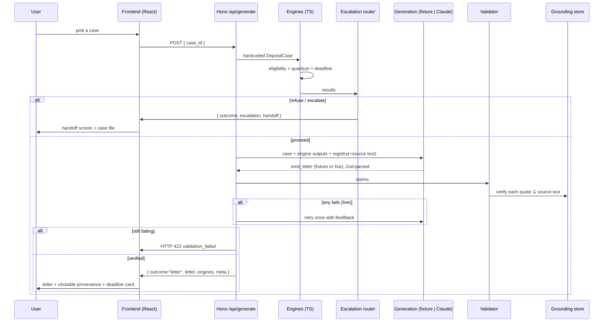

# Law Gun — Deposit Return POC Architecture (as built)

> **Status: implemented.** This document describes the POC as actually built under `recourse-poc/`, including the decisions and deviations from the original design. Run instructions live in `recourse-poc/README.md`.

**Vertical:** Unprotected / mishandled tenancy deposit (England & Wales), Housing Act 2004 ss 213–214.
**Demo cases:** three hardcoded cases that exercise the three terminal outcomes — *Jamie* (Birmingham, £980, no scheme, no prescribed information → **draft**), *Multiple renewals* (→ **escalate**), *Lodger / licence* (→ **refuse**).
**What it produces:** a CPR-compliant Letter Before Claim demanding return of the deposit plus the statutory 1×–3× penalty, where every legal sentence is grounded in primary law, the deadline and amounts are computed in code, and the case escalates to a human solicitor when it leaves safe scope.

The architecture is built around one principle: **the model never decides what the law is, what a deadline is, or what a number is.** It selects from a vetted set of legal propositions, fills a vetted template, and everything legally or numerically load-bearing is computed and verified deterministically.

---

## 0. Key decisions & deviations from the original design

| Area | Original design | As built | Why |
|---|---|---|---|
| Backend language/framework | FastAPI (Python) | **Hono on Node 22 (TypeScript)** | One language across the repo; web-standard handlers; clean Cloud Run target. |
| Schemas / validation | Pydantic | **Zod** (`z.infer` for types, `z.toJSONSchema` for the tool schema) | Same runtime-validation role; shared types front-to-back; Zod v4 ships a native JSON-schema converter. |
| Intake | Conversational state machine | **Three hardcoded `DepositCase`s** (`cases.ts`) | "Hardcoded defaults for now" — the chat is deferred; the cases drive the demo's three outcomes. |
| Grounding scope | ss 213/214/215 + PI Order + Limitation Act ss 5/9 | **HA 2004 ss 213 & 214 only** (6 chunks) | Those cover all six verbatim-validated claims (R1, R2, R4–R7). Other rules inform the engines as R-codes, not as quoted letter claims. |
| Grounding integrity | Fetch + cache | Fetch + cache **+ build-time anchor verification** | `fetchGrounding.ts` fails loudly if any registry anchor is no longer a substring of the live statute. |
| Generation | Two-stage structured output; "strict" tool | **One forced `emit_letter` tool call**; shape guaranteed by `EmitLetterSchema.parse` | Anthropic tool use has no OpenAI-style `strict` flag; forcing `tool_choice` + Zod-parse is the robust equivalent. |
| Offline operation | (not specified) | **Fixture-first: runs offline by default** | A recorded `emit_letter` output (`fixture_jamie.json`) flows through the *same* validator, so the demo is reliable with no API key. |
| Validator matching | Whitespace-collapse + Levenshtein ≤ ε | **Exact normalized substring** (one shared `normalize`) | Simpler and sufficient: the model copies from the same extracted text the validator checks against. |
| Terminal outcomes | proceed / escalate | **proceed / escalate / refuse**, each with a handoff package | The added refuse branch makes scope boundaries a real, demonstrable outcome. |
| Model | Claude (structured output) | **`claude-opus-4-8`** (env `MODEL_ID`) | Latest Opus for the legal-fidelity task; configurable. |

---

## 1. The legal model this POC encodes

Every rule maps to a primary source the system caches and quotes. Rules **R1, R2, R4–R7** are the *verbatim-validated letter claims* (in the grounding store and the registry). The rest (**R3, R8–R13**) are encoded in the deterministic engines / router as R-code references — they shape behaviour but are not quoted in the letter.

| # | Rule the system encodes | Source | What the code does |
|---|---|---|---|
| R1 | Deposit must be protected in an authorised scheme within **30 days** | HA 2004 s.213(3) | Eligibility breach check; verbatim claim |
| R2 | **Prescribed information** within 30 days | HA 2004 s.213(6) + PI Order 2007 | Eligibility breach check; verbatim claim |
| R3 | Only **three** authorised schemes (DPS, MyDeposits, TDS) | HA 2004 s.212 / Sch 10 | Intake guidance (deferred); evidence checklist |
| R4 | Tenant may apply to the **county court** on breach | HA 2004 s.214(1)(a) | Eligibility reason; verbatim claim |
| R5 | Claim **applies even where the tenancy has ended** | HA 2004 s.214(1A) | Selected only if `tenancy_ended`; verbatim claim |
| R6 | Court **may order repayment** of the deposit within 14 days | HA 2004 s.214(3A) | Quantum (deposit return); verbatim claim |
| R7 | Court **must order 1×–3×** the deposit within 14 days | HA 2004 s.214(4) | Quantum (penalty range); verbatim claim |
| R8 | **Single award** per tenancy for a s.213(3)/(6) breach | s.214(1)(a); *Okadigbo v Chan* | One penalty per tenancy (no double-count) |
| R9 | Roll-overs can trigger **fresh** obligations → multiple penalties | *Superstrike*; Deregulation Act 2015 | `renewals == multiple` → **escalate** |
| R10 | **Limitation: 6 years** from **day 31** | Limitation Act 1980 s.9; *Lowe* [2024] | Deadline engine; `uncertainty_flag` |
| R11 | Penalty **multiplier is discretionary** (~1.5×–3×) | *Davies v Scott*; *Okadigbo* | Quantum emits a **range** + `discretion_note_ref` |
| R12 | Usually **CPR Part 8** (form **N208**); disputed facts → Part 7 | CPR Part 8 | Next-steps wording; disputed facts → escalate |
| R13 | No dedicated protocol → **PDPACP** (14-day default) | CPR PD Pre-Action Conduct | Template + `lbc_response_deadline` |

**Scope boundary (hard):** AST, money deposit, tenancy on/after 6 Apr 2007, England or Wales. Anything else → **refuse and explain**.

---

## 2. System overview (as built)

```
                 ┌──────────────────────────────────────────────────┐
                 │            FRONTEND — React + Vite (TS)           │
                 │  CasePicker │ Letter (clickable provenance spans) │
                 │             │ ProvenanceDrawer │ DeadlineCard      │
                 │             │ HandoffScreen                        │
                 └──────▲────────────────────────────▲───────────────┘
                        │ GET /api/cases              │ POST /api/generate
                        │                             │ → letter | escalate | refuse
        ┌───────────────┴─────────────────────────────┴────────────────┐
        │                  BACKEND — Hono on Node (TS)                   │
        │  cases.ts  (jamie / renewals / lodger)        ← hardcoded intake│
        │       │  DepositCase (Zod)                                      │
        │       ▼                                                          │
        │  ┌──────────┐  ┌─────────┐  ┌──────────┐                        │
        │  │Eligibility│  │ Quantum │  │ Deadline │  ← pure TS, vitest-ed  │
        │  └────┬─────┘  └────┬────┘  └────┬─────┘                        │
        │       └─────────────┼────────────┘                              │
        │                     ▼                                            │
        │              ┌─────────────┐ refuse / escalate                   │
        │              │  Escalation │────────────────▶ Handoff package    │
        │              │   router    │                                     │
        │              └──────┬──────┘ proceed                             │
        │                     ▼                                            │
        │   ┌──────────────────────────────────────────────┐              │
        │   │ Generation (generation.ts)                    │              │
        │   │ fixture_jamie.json  OR  @anthropic-ai/sdk     │              │
        │   │ single FORCED emit_letter tool call           │              │
        │   └────────────────────┬─────────────────────────┘              │
        │                        ▼                                         │
        │   ┌──────────────────────────────────────────────┐              │
        │   │ Quote-then-cite validator (validator.ts)      │              │
        │   │ normalize(quote) ⊆ normalize(source.text)     │              │
        │   │ fail → retry once (live only) → else HTTP 422  │              │
        │   └────────────────────┬─────────────────────────┘              │
        │                        ▼  assembler.ts                           │
        │            LetterArtifact + provenance_map                       │
        └────────────────────────────────────────────────────────────────┘
                        ▲ grounding.ts loads at import
        ┌───────────────┴───────────────────┐
        │  data/grounding_store.json (committed)                 │
        │  HA 2004 ss 213 & 214 — 6 verbatim chunks              │
        │  built by scripts/fetchGrounding.ts                    │
        │  (verifies every registry anchor at build time)        │
        └────────────────────────────────────────────────────────┘
```

Shared invariant: a single `normalize()` (`src/text.ts`) is used by the fetch script, the validator, and the build-time anchor check — that is what makes the substring guarantee sound.

---

## 3. Components (as built)

### 3.1 Hardcoded intake — `cases.ts`
The conversational state machine (original §3.1) is **deferred**. Instead, three fully-populated `DepositCase`s stand in for intake: `jamie` (proceed), `renewals` (escalate), `lodger` (refuse). `GET /api/cases` lists them for the picker; `getCase(id)` resolves one. Party fields (`tenant_name`, `tenant_address`, `property_address`) were added beyond the original schema so the letter is actually addressable.

### 3.2 Case state object — `models.ts`
The single source of truth, defined once as Zod schemas; TypeScript types are derived with `z.infer`. (Schemas in §5.)

### 3.3 Eligibility engine (deterministic) — `engines/eligibility.ts`
Pure `case → EligibilityResult`. In-scope gate (AST ∧ money ∧ ≥ 2007-04-06 ∧ England/Wales); breach detection on `protected_status == "no"` (R1) / `prescribed_info_received == "no"` (R2); adds R4 when in-scope + breached. `"unknown"` is **not** treated as a breach — it routes to escalation instead of guessing.

### 3.4 Quantum engine (deterministic) — `engines/quantum.ts`
Pure `case → QuantumResult`. Computed in **integer pence** to avoid float drift: `penalty_min = deposit`, `penalty_max = 3 × deposit`, `deposit_return = max(0, deposit − returned)`. Always a **range** with `discretion_note_ref = "R11"`. Multi-tenancy (R9) is not auto-computed — those cases escalate first.

### 3.5 Deadline engine (deterministic) — `engines/deadline.ts`
Pure `case → DeadlineResult` using `date-fns`. `limitation_expiry = date_deposit_paid + 30d + 6y` (R10); `days_remaining = differenceInCalendarDays(expiry, today)`; status bands `critical < 30 ≤ urgent < 90 ≤ watch ≤ 180 < ample`; `lbc_response_deadline = today + 14d`; `uncertainty_flag = true`. Dates are parsed as **local midnight** so results are timezone-independent (the tests rely on this). `today` is injectable for deterministic tests.

### 3.6 Grounding store — `scripts/fetchGrounding.ts` → `data/grounding_store.json`
A one-shot builder. Fetches HA 2004 s.213 and s.214 `/data.xml` from legislation.gov.uk, finds each target subsection by element id (e.g. `section-214-4`), concatenates **all descendant text in document order** (via `@xmldom/xmldom`), and `collapseWhitespace`s it into one canonical chunk. **Build-time guarantee:** every registry `verbatim_anchor` must be a normalized substring of its chunk, or the build fails. s.214(1A) lives inside section 214, so one fetch covers R4–R7. The store holds 6 chunks (R1, R2, R4, R5, R6, R7). `grounding.ts` loads it into a `source_id → chunk` Map at import.

### 3.7 Generation pipeline — `generation.ts`
A single, FORCED Anthropic tool call (`@anthropic-ai/sdk`). `tool_choice` pins the `emit_letter` tool whose `input_schema` is produced from `EmitLetterSchema` via `z.toJSONSchema`. The model **selects** `claim_id`s (registry only) and **fills** the six narrative slots; it is given the engine numbers as data and told never to recompute them, and the full source text and told to copy each `verbatim_quote` exactly. The static system prompt + rendered registry block are sent as **cache_control** blocks. Anthropic has no `strict` flag, so shape is guaranteed by `EmitLetterSchema.parse(toolUse.input)` (a parse failure counts as a generation failure).

**Fixture-first:** if `ANTHROPIC_API_KEY` is absent or `USE_FIXTURE=1`, it loads `data/fixture_jamie.json` instead — parsed through the *same* schema, validated by the *same* validator. The whole demo runs offline with genuine green ticks.

### 3.8 Quote-then-cite validator (deterministic, code) — `validator.ts`
For each emitted claim: look up `source_id` in the store (missing → fail); `verified = normalizeForMatch(source.text).indexOf(normalizeForMatch(quote)) !== -1`; record `matched_offset`. `ok = no failures ∧ at least one claim ∧ every claim verified ∧ selected_claim_ids ⊆ registry`. `normalize` = lowercase + smart-quote/dash→ascii + zero-width strip + whitespace-collapse. **No Levenshtein** (exact normalized substring). On failure: the route retries generation **once** (live only) with the failing claims fed back, then returns **HTTP 422** rather than shipping an unverifiable letter. `citation`/`uri` on the output `GroundedClaim` come from the store/registry, never the model. A deliberately-broken test proves rejection (`test/validator.test.ts`).

### 3.9 Letter assembler — `assembler.ts`
Builds the `LetterArtifact`: parties/header, narrative slots, a "The law" section containing each validated `rendered_sentence` **verbatim** (so the frontend can wrap them as clickable spans), and an authoritative "What I require" block whose **figures come from `QuantumResult`/`DeadlineResult`, not the model's prose**. Outputs `body_markdown` + `provenance_map` + enclosures + deadline.

### 3.10 Escalation router (deterministic) — `escalation.ts`
Pure `(case, eligibility, deadline) → EscalationDecision` with `kind ∈ {proceed, escalate, refuse}`. **Refuse** if out of scope, or in-scope but no breach. **Escalate** if `renewals == multiple` (R9), `deadline.status == critical`, or any unknown slot remains. Else **proceed**. Over-escalates by design.

### 3.11 Handoff package — `handoff.ts`
On escalate/refuse, bundles the case, engine outputs, reasons, an evidence checklist, and a human-readable `solicitor_summary`, under a stable, time-free `id`. Rendered by `HandoffScreen`.

### 3.12 Frontend — `frontend/src/`
React + Vite (TS), one screen. `CasePicker` (from `/api/cases`); `Letter` renders `body_markdown` with a small purpose-built markdown renderer that wraps each grounded sentence as a clickable provenance span (verified ✓ / unverified ✗); `ProvenanceDrawer` (**the centerpiece**) shows citation, the legislation.gov.uk URI, the matched offset, the rendered sentence, and the full source text with the `verbatim_quote` highlighted, plus a green verified verdict; `DeadlineCard` shows the quantum range + limitation status; `HandoffScreen` renders the escalate/refuse outcome with the case-file JSON. A "N/N legal statements verified" green bar tops the letter. The Vite dev server proxies `/api` to the backend.

---

## 4. Data flow (request → outcome)



---

## 5. Data models (Zod schemas) — `models.ts`

```jsonc
// DepositCase — single source of truth (party fields added beyond original §5)
{
  "deposit_amount": 980.0, "date_deposit_paid": "2024-09-01",
  "tenancy_type": "AST",            // AST | other
  "country": "England",             // England | Wales | other
  "tenancy_start_date": "2024-09-01",
  "protected_status": "no",         // yes | no | unknown
  "prescribed_info_received": "no", // yes | no | unknown
  "tenancy_ended": false, "tenancy_end_date": null,
  "deposit_returned": false, "amount_returned": 0.0,
  "renewals_or_rollovers": "none",  // none | one | multiple
  "landlord_or_agent": "landlord",  // landlord | agent
  "landlord_name": "…", "landlord_address": "…",
  "tenant_name": "…", "tenant_address": "…", "property_address": "…",
  "unknown_slots": []
}

// EligibilityResult
{ "in_scope": true, "breach": true, "breach_types": ["s213(3)","s213(6)"], "reasons": ["R1","R2","R4"] }

// QuantumResult
{ "deposit_return": 980.0, "penalty_min": 980.0, "penalty_max": 2940.0,
  "tenancy_count": 1, "basis": ["R6","R7"], "discretion_note_ref": "R11" }

// DeadlineResult
{ "limitation_expiry": "2030-10-01", "days_remaining": 1585, "status": "ample",
  "lbc_response_deadline": "2026-06-13", "uncertainty_flag": true, "basis": ["R10"] }

// LegalSourceChunk (grounding store)
{ "source_id": "ha2004-s214-4", "citation": "Housing Act 2004, s.214(4)",
  "uri": "…/section/214", "text": "…verbatim…", "in_force_date": null, "retrieved_at": "2026-05-30" }

// RegistryEntry (allowed-claims registry, §6) — verbatim_anchor verified at build time
{ "claim_id": "R7", "proposition": "…", "source_id": "ha2004-s214-4",
  "citation": "Housing Act 2004, s.214(4)", "uri": "…", "verbatim_anchor": "…" }

// EmitLetter — the forced tool input the model fills
{ "selected_claim_ids": ["R1","R2","R4","R6","R7"],
  "letter_sections": { "intro":"…","facts":"…","breach":"…","claim":"…","adr":"…","next_steps":"…" },
  "claims": [ { "claim_id":"R7", "rendered_sentence":"…", "source_id":"ha2004-s214-4", "verbatim_quote":"…" } ] }

// GroundedClaim (post-validation) — citation/source_text added for the drawer
{ "claim_id": "R7", "rendered_sentence": "…", "source_id": "ha2004-s214-4", "uri": "…",
  "citation": "Housing Act 2004, s.214(4)", "verbatim_quote": "…",
  "verified": true, "matched_offset": 78, "source_text": "…" }

// EscalationDecision — kind added for routing
{ "kind": "proceed", "escalate": false, "reasons": [], "handoff_package_id": null }

// LetterArtifact
{ "body_markdown": "…", "provenance_map": [GroundedClaim, …],
  "enclosures": ["Copy of the tenancy agreement (AST)", …], "deadline": DeadlineResult }

// HandoffPackage
{ "id": "pkg-escalate-…", "kind": "escalate", "reasons": [...], "case": DepositCase,
  "eligibility": …, "quantum": … | null, "deadline": …,
  "evidence_checklist": [...], "solicitor_summary": "…" }

// POST /api/generate response (discriminated on `outcome`)
//  proceed:  { outcome:"letter", letter:LetterArtifact, engines:{eligibility,quantum}, meta:{source,validator,model_id} }
//  else:     { outcome:"escalate"|"refuse", escalation:EscalationDecision, handoff:HandoffPackage }
//  reject:   HTTP 422 { error:"validation_failed", failures:[…] }
```

---

## 6. Allowed-claims registry (the anti-hallucination core) — `registry.ts`

The generator may assert **only** these propositions, each pre-bound to a source and a build-time-verified `verbatim_anchor`. A new claim cannot enter a letter without being added here and verified against the store.

| claim_id | Proposition (plain) | source_id | citation |
|---|---|---|---|
| R1 | Deposit protected in an authorised scheme within 30 days | ha2004-s213-3 | HA 2004 s.213(3) |
| R2 | Prescribed information given within 30 days | ha2004-s213-6 | HA 2004 s.213(6) |
| R4 | Tenant may apply to the county court on breach | ha2004-s214-1a | HA 2004 s.214(1)(a) |
| R5 | Claim applies even after the tenancy has ended | ha2004-s214-1A | HA 2004 s.214(1A) |
| R6 | Court may order repayment of the deposit within 14 days | ha2004-s214-3A | HA 2004 s.214(3A) |
| R7 | Court must order 1×–3× the deposit within 14 days | ha2004-s214-4 | HA 2004 s.214(4) |

`verbatim_anchor` is authored by us and proven a substring of the store by `fetchGrounding.ts`. The offline fixture reuses these anchors; live generation must independently emit a quote the validator confirms. The model never authors the canonical anchor.

---

## 7. Prompt architecture — `generation.ts`

- **System prompt (cached):** persona (calm, plain-English), "legal information not advice", hard rules — assert only registry propositions, copy `verbatim_quote` exactly from the provided SOURCE TEXT, use only the supplied numbers (keep £ amounts out of the prose), PDPACP tone, respond only via `emit_letter`.
- **Registry block (cached):** each allowed claim rendered with its `source_id`, citation, and full normalized SOURCE TEXT.
- **User message:** the `DepositCase` and the engine outputs as data, plus the task (select claim_ids, fill the six slots, emit one `claims[]` entry per selected claim). On a retry, the failed claims + reasons are appended.
- **Guarantee is code, not prompt:** forced `tool_choice` makes the tool fire; `EmitLetterSchema.parse` guarantees shape; the validator guarantees grounding. The model is constrained then verified, never trusted.

---

## 8. Tech stack & deployment (as built)

- **Frontend:** React 19 + Vite 8 (TypeScript). Components in `frontend/src/components/`. Dev proxy `/api → :8000`.
- **Backend:** Hono on Node 22 (TypeScript), run with `tsx`. `@hono/node-server`.
- **Model:** `@anthropic-ai/sdk` (`claude-opus-4-8` by default, env `MODEL_ID`), single forced tool call.
- **Schemas:** Zod v4 (`z.infer`, native `z.toJSONSchema`).
- **Legislation fetch:** `@xmldom/xmldom` (DOM text extraction); Node global `fetch`.
- **Dates:** `date-fns`. **Money:** integer pence.
- **Tests:** vitest (`backend/test/`).
- **Grounding store:** static committed JSON; no database.
- **State:** stateless per request; cases are constants.
- **Config:** offline by default (no key → fixture). `USE_FIXTURE`, `ANTHROPIC_API_KEY`, `MODEL_ID`, `PORT`.
- **Hosting target:** a single Node container on Google Cloud Run (frontend built to static assets, or served separately).

---

## 9. Build status (milestones — all complete)

1. ✅ Scaffold + core data — `models.ts`, `registry.ts`, `cases.ts` (3 cases).
2. ✅ `fetchGrounding.ts` → committed `grounding_store.json` (ss 213/214; anchors verified at build time).
3. ✅ Deterministic engines + tests (`engines.test.ts`).
4. ✅ Escalation router + handoff + tests (`escalation.test.ts`).
5. ✅ Quote-then-cite validator + tests, incl. the deliberately-broken claim (`validator.test.ts`).
6. ✅ Generation + offline fixture; fixture passes the real validator (`generation.test.ts`).
7. ✅ Assembler + Hono routes; verified e2e via curl for all three cases.
8. ✅ Vite/React frontend incl. the provenance drawer; verified with real headless-Chrome screenshots.
9. ✅ Run scripts, `.gitignore`, README.

---

## 10. Eval / tests (implemented)

`npm test` runs **15 vitest tests across 4 files**:

| File | Asserts |
|---|---|
| `engines.test.ts` | Jamie: in-scope, both breaches, reasons R1/R2/R4; penalty £980–£2,940, deposit return £980; limitation 2030-10-01, 1585 days, ample, respond-by 2026-06-13; pence math has no float drift; critical-deadline band. |
| `escalation.test.ts` | jamie→proceed, renewals→escalate (Superstrike), lodger→refuse (out of scope), critical-deadline→escalate. |
| `validator.test.ts` | accepts a real quote; **rejects a fabricated quote** (demo exhibit); rejects an unknown `source_id`; robust to case/whitespace. |
| `generation.test.ts` | the offline fixture loads and **all 5 claims pass the real validator**. |

Backend e2e (curl) and frontend (typecheck + production build + headless-Chrome screenshots of letter / drawer / refuse) were also verified manually. Headline guarantees met: citation-existence and quote-fidelity enforced by the validator (100% or the letter is a 422); deadline/eligibility arithmetic pinned by tests; escalation recall demonstrated on the three cases.

---

## 11. Risk register / legal edge cases

- **Limitation start date** is settled at day-31 by *Lowe*; the end-of-tenancy argument is untested → compute from the earlier date, carry `uncertainty_flag`, escalate near 6 years.
- **Superstrike roll-overs** → fact-sensitive multiple penalties → **escalate**, never auto-compute.
- **Single vs multiple award** within one tenancy (R8) → one penalty; don't double-count.
- **Prescribed-information adequacy** (*Ayannuga*) is fact-sensitive → if PI quality is the only issue, escalate.
- **Out-of-scope tenancies** (lodger, licence, resident landlord, company let, pre-2007) → refuse cleanly.
- **Quantum** is discretionary → always a range with case-law framing; never a single figure.
- **Not legal advice** → legal information + drafting at the user's instruction, handing off to an SRA-regulated solicitor; framing kept visible in the UI and system prompt.
- **Grounding drift** → if legislation.gov.uk text changes, `fetchGrounding.ts` fails the build at the anchor check rather than silently shipping a wrong quote.
- **Procedure** → Part 8 / N208 usual; disputed-fact (Part 7) cases → escalate.
